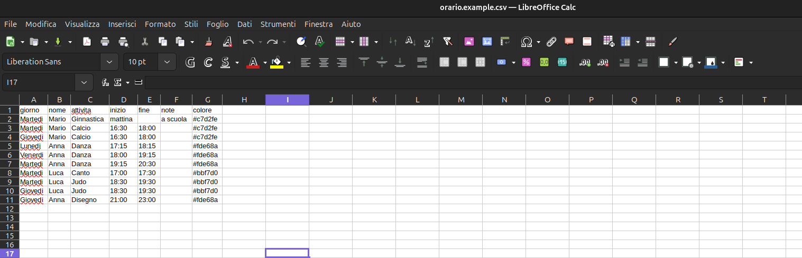
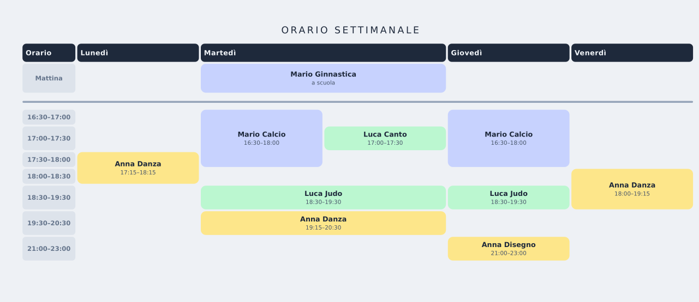

# Orario Settimanale

Genera un PDF con l'orario settimanale delle attività extrascolastiche a partire da un semplice file CSV.

## Come funziona

```
orario.csv  →  genera_html.py  →  orario.html  →  WeasyPrint  →  orario.pdf
```

Il tutto gira dentro un container Docker: **non serve nessuna dipendenza sul sistema host** tranne `docker` e `make`.

### Dal CSV al PDF

**1. I dati di partenza** — un semplice foglio CSV (modificabile anche con Excel o LibreOffice):



**2. Il risultato** — orario settimanale pronto per la stampa:



## Utilizzo

1. Copia `orario.example.csv` in `orario.csv` e modificalo con i tuoi dati
2. Esegui:

```bash
make                       # genera orario.pdf da orario.csv
make CSV=famiglia.csv      # genera famiglia.pdf da famiglia.csv
```

Il PDF prende lo stesso nome del CSV.

## Formato CSV

```
giorno,nome,attivita,inizio,fine,note
```

| Campo      | Valori accettati                                          |
|------------|-----------------------------------------------------------|
| `giorno`   | `Lunedi`, `Martedi`, `Mercoledi`, `Giovedi`, `Venerdi`   |
| `nome`     | Nome del bambino (determina il colore nella tabella)      |
| `attivita` | Nome dell'attività (es. `Calcio`, `Danza`, `Judo` …)     |
| `inizio`   | Orario `HH:MM` oppure `mattina`                           |
| `fine`     | Orario `HH:MM` — lasciare **vuoto** se `inizio` è `mattina` |
| `note`     | Testo opzionale mostrato sotto il nome (es. `a scuola`)  |
| `colore`   | Colore HTML opzionale (es. `#fde68a`); se assente usa il default per nome |
| `stampa`   | Se `no`, la riga viene ignorata nella generazione (default: inclusa)      |

Gli orari vengono arrotondati automaticamente al quarto d'ora di 30 minuti più vicino per la costruzione della griglia.  
Se due attività si sovrappongono nello stesso giorno, la colonna viene **divisa automaticamente** in due sotto-colonne.

### Escludere una riga dalla stampa

Imposta `stampa=no` per tenere una riga nel CSV senza farla comparire nell'output:

```
Sabato,Mario,Nuoto,09:00,10:30,,#c7d2fe,no
```

Utile per attività sospese temporaneamente o dati da tenere in archivio.

### Colori automatici

I colori delle celle vengono assegnati automaticamente per nome. I nomi riconosciuti di default sono `Linda`, `Mariel`, `Vittoria`. Per un nome nuovo o per sovrascrivere il default, specifica il colore HTML nel campo `colore` del CSV.

## Comandi Make

Tutti i comandi accettano il parametro opzionale `CSV=file.csv` (default: `orario.csv`).

| Comando                      | Descrizione                                          |
|------------------------------|------------------------------------------------------|
| `make`                       | Costruisce l'immagine e genera il PDF                |
| `make CSV=altro.csv`         | Come sopra ma con un CSV diverso                     |
| `make build`                 | Solo build dell'immagine Docker                      |
| `make run`                   | Solo generazione PDF (richiede build precedente)     |
| `make run CSV=altro.csv`     | Genera PDF da un CSV specifico                       |
| `make rebuild`               | Forza rebuild completo dell'immagine e rigenera      |
| `make clean`                 | Rimuove i file generati e l'immagine Docker          |

## Struttura del progetto

```
├── genera_html.py        # Script Python: CSV → HTML
├── generate-pdf.sh       # Script shell: avvia Python + WeasyPrint
├── Dockerfile            # Immagine con Python + WeasyPrint
├── docker-compose.yml    # Monta la directory locale nel container
├── Makefile              # Comandi di build e generazione
├── orario.example.csv    # CSV di esempio (struttura dati)
└── .github/
    └── workflows/
        └── genera-pdf.yml  # CI: genera e verifica il PDF su ogni push
```
